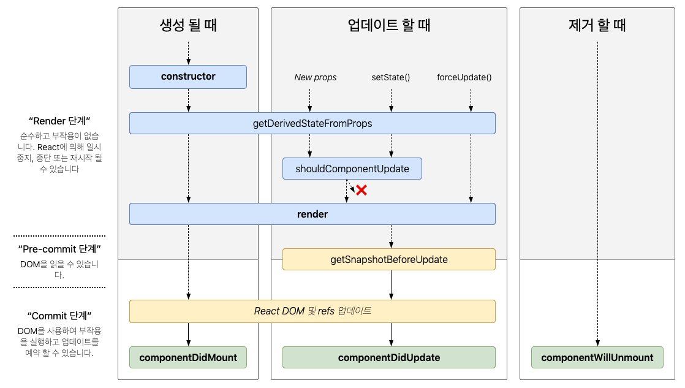

# 1.22 ~ 2.3

## 22. Context API

프로젝트 안에서 전역적으로 사용할 수 있는 값을 관리 (꼭 상태일 필요는 없다)

- `React.createContext(기본값)` : Context 생성
- `Provider` : Context의 값 지정
- `useContext()` : 만든 UserDispatch Context를 조회하는 hook

```jsx
// App.js
export const UserDispatch = React.createContext(null);
const [state, dispatch] = userReducer(reducer, initialState);
<UserDispatch.Provider value={dispatch}> ... </UserDispatch.Provider>

// UserList.js
import { UserDispatch } from "./App";
const dispatch = useContext(UserDispatch);
return (
	<button
    onClick={() => {
      dispatch({ type: 'REMOVE_USER', id: user.id });
    }}
  >
)
```

## 23. Immer

상태 업데이트 시 불변성 관리를 대신해주는 라이브러리

```jsx
import produce from "immer";
const nextState = produce(state, (draft) => {
  draft.number += 1;
});
// state : 수정하고 싶은 상태
// draft => {} : 상태 업데이트 함수
```

(!) 첫번째 파라미터`state` 생략 시, 변환값은 상태가 아닌 함수가 된다

```jsx
const updater = produce((draft) => {
  draft.done = !draft.done;
});
```

## 24. 클래스형 컴포넌트

```jsx
class Hello extends Component {
  constructor(props) {
    super(props);
    this.handleIncrease = this.handleIncrease.bind(this);
    this.state = {
      counter: 0,
    };
  }

  handleIncrease() {
    console.log("increase", this);
  }

  render() {
    const { color, name } = this.props;
    return (
      <div style={{ color }}>
        안녕하세요 {name}
        <button onClick={this.handleIncrease}>+1</button>
      </div>
    );
  }
}

Hello.defaultProps = {
  name: "이름없음",
};

export default Hello;
```

`render()` : 필수! 렌더링하고 싶은 `JSX` 반환!

`props` : `this.props` 로 조회

`this` : 컴포넌트 인스턴스를 가리킬때 반드시 필요.

- 이벤트 등록 과정에서 연결이 끊김
  → 클래스 생성자 메서드 `constructor` 에서 `bind` 작업을 통해 연결
- `super(props)` : 컴포넌트에 구현된 생성자 함수를 먼저 실행하겠다는 의미

`state` : 상태관리. `constructor` 에서 `this.state` 로 설정. 반드시 **객체**

- 상태 업데이트 : `this.setState()` . 함수형으로도 업데이트 가능
  (!) `setState` 는 상태변경을 요청하는 함수로, 비동기적 업데이트가 된다. → 객체로 업데이트 요청을 보내면, 동일 내역이 여러번 요청되어도 한번만 수행된다.

## 25. 생명주기

컴포넌트가 브라우저 상에서 나타나고, 업데이트 되고, 사라지게 될 때 호출되는 메서드들



- 마운트
  - `constructor`
    컴포넌트 생성자 메서드. 가장 먼저 실행.
  - `getDerivedStateFromProps`
    `props` 로 받아온 것을 `state` 에 넣어 주고 싶을 때 사용
  - `render`
    컴포넌트를 렌더링
  - `componentDidMount`
    컴포넌트의 첫번째 렌더링이 마치고 나면 호출되는 메서드
    호출 시점 : 컴포넌트가 화면에 나타난 상태
    DOM을 사용해야하는 외부 라이브러리 연동(D3, masonry)
    axios, fetch 등을 통한 ajax 요청, DOM 속성 읽기 등 작업 진행
- 업데이트 : 컴포넌트가 업데이트 되는 시점
  - `getDerivedStateFromProps`
    `props` , `state` 가 바뀌었을 때 호출
  - `shouldComponentUpdate`
    컴포넌트 리렌더링 여부를 결정하는 메서드. 최적화할 때 사용.
  - `render`
  - `getSnapshotBeforeUpdate`
    컴포넌트에 변화가 일어나기 직전의 DOM 상태를 가져와서 특정값을 반환하면 그 다음 발생하게 되는 `componentDidUpdate` 함수에서 받아와서 사용가능
  - `componentDidUpdate`
    리렌더링 후, 모든 변화가 반영된 후 호출. 3번째 파라미터로 `getSnapshotBeforeUpdate` 에서 반환한 값을 조회 가능
- 언마운트 : 컴포넌트가 화면에서 사라지는 시점
  - `componentWillUnmount`
    컴포넌트가 화면에서 사라지기 직전 호출
    DOM에 직접 등록했던 이벤트 제거
    `setTimeout` 등 제거
    외부 라이브러리에 dipose 기능이 있다면 호출

## 26 componentDidCatch, Sentry

에러체크 방법

- null checking
  `props` 값이 없을 때 조건문을 통해 `null` 을 렌더링

```jsx
function Users({ users }) {
  if (!users) return null;

  return (
    <ul>
      {users.map((user) => (
        <li key={user.id}>{user.username}</li>
      ))}
    </ul>
  );
}
```

- `componentDidCatch`

사전에 예외처리하지 않은 에러가 발생했을 때, 에러를 잡아냄

`componentDidCatch(error, info)`

- error : 에러의 내용
- info : 에러 발생 위치

### Sentry

에러 체크 솔루션. `componentDidCatch` 로 잡아낸 에러 정보를 별도의 서버에서 수집하는 솔루션.

## 27. Prettier, ESLint, Snippet

### Prettier

자동으로 코드 스타일을 관리해주는 도구. `.prettierrc` 에서 설정 관리

### ESLint

자바스크립트의 문법을 확인해주는 도구

### Snippet

에디터 내장 기능. 자주 사용되는 코드의 단축어를 만들어 코드 생성 빠르게.

## 2.1 Sass

CSS 전처리기. `.scss`, `.sass` 두가지 확장자 지원. 주로 `scss` 문법을 씀
(`sass` 는 브라켓이 없다)

- `classnames` 라이브러리 : class를 설정하는 것을 도와줌

```jsx
classNames("foo", "bar"); // => 'foo bar'
classNames("foo", { bar: true }); // => 'foo bar'
classNames({ "foo-bar": true }); // => 'foo-bar'
classNames({ "foo-bar": false }); // => ''
classNames({ foo: true }, { bar: true }); // => 'foo bar'
classNames({ foo: true, bar: true }); // => 'foo bar'
classNames(["foo", "bar"]); // => 'foo bar'

// 동시에 여러개의 타입으로 받아올 수 도 있습니다.
classNames("foo", { bar: true, duck: false }, "baz", { quux: true }); // => 'foo bar baz quux'

// false, null, 0, undefined 는 무시됩니다.
classNames(null, false, "bar", undefined, 0, 1, { baz: null }, ""); // => 'bar 1'
```

- 변수 선언 `$`
- `@mixin` : 반복코드되는 코드를 선언해서 재사용 가능
- `@include` : 선언한 `mixin` 호출

```sass
$blue: #228be6;

@mixin button-color($color) {
  background: $color;
}

.Button.blue {
	@include button-color($blue);
}
```

## 2.2 CSS Module

리액트 프로젝트에서 컴포넌트 스타일링을 할 때, CSS 클래스가 중첩되는 것을 방지 가능. `.module.css` 확장자. `scss` 도 가능

클래스 이름이 고유해짐 → 경로, 이름, 클래스, 해쉬값 등이 사용되기 때문
ex) `Box.module.css` 의 `.Box` ⇒ `class="_src_Box_module__Box"`

**리액트 클래스 네이밍 규칙**

- 컴포넌트 이름은 다른 컴포넌트와 중복X
- 컴포넌트의 최상단 CSS 클래스는 컴포넌트 이름과 일치
- 컴포넌트 내부에서 보여지는 CSS 클래스는 CSS Selector를 활용

## 2.3 styled-components

**CSS in JS(**JS안에 CSS를 작성) 기술의 라이브러리.
**Tagged Template Literal** 사용 `${ }`
대안: `emotion`, `styled-jsx`

- 사용법 : `styled.태그` 로 선언 및 스타일 입력하여 컴포넌트 생성
