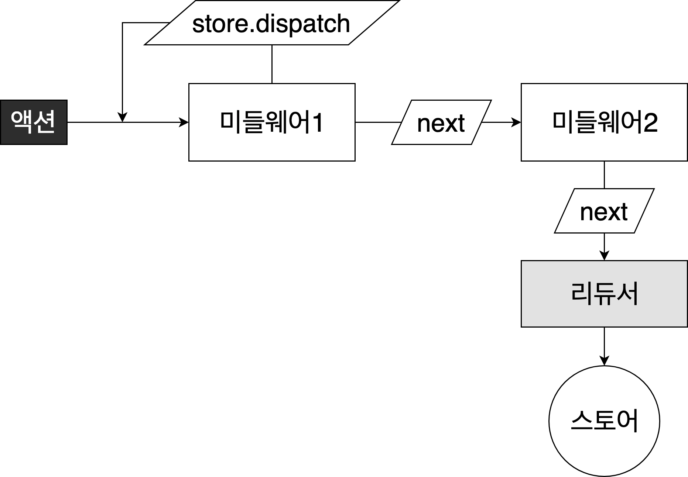

# 7 리덕스 미들웨어(7.1~7.5)


액션 디스패치 → [ 미들웨어 추가작업 ] →리듀서에서 해당 액션을 받아서 업데이트

**미들웨어의 추가작업**

- 특정 조건에 따라 액션 무시
- 액션 콘솔 출력, 서버 로깅
- 액션이 디스패치 됐을 때 이를 수정해서 리듀서에 전달
- 특정 액션이 발생했을 때, 이에 기반하여 다른 액션 발생
- 특정 액션이 발생했을 때, 특정 자바스크립트 함수 실행
- <주사용법> 비동기 작업 처리 (백엔드 API 연동)
- 예시: `redux-thunk`, `redux-saga`, `redux-observable`, `redux-promise-middlewar`, `redux-logger`

## 1. 준비

### 모듈 준비

**modules/counter.js**

```jsx
// 액션 타입
const INCREASE = "INCREASE";
const DECREASE = "DECREASE";

// 액션 생성 함수
export const increase = () => ({ type: INCREASE });
export const decrease = () => ({ type: DECREASE });

// 초깃값
const initialState = 0;

export default function counter(state = initialState, action) {
  switch (action.type) {
    case INCREASE:
      return state + 1;
    case DECREASE:
      return state - 1;
    default:
      return state;
  }
}
```

**modules/index.js**

```jsx
import { combineReducers } from "redux";
import counter from "./counter";

const rootReducer = combineReducers({ counter });

export default rootReducer;
```

### 리덕스 적용

**index.js**

```jsx
import React from "react";
import ReactDOM from "react-dom";
import App from "./App";
import * as serviceWorker from "./serviceWorker";
import { createStore } from "redux";
import { Provider } from "react-redux";
import rootReducer from "./modules";

const store = createStore(rootReducer);

ReactDOM.render(
  <Provider store={store}>
    <App />
  </Provider>,
  document.getElementById("root")
);
```

### 프리젠테이셔널 컴포넌트

**components/Counter.js**

```jsx
import React from "react";

function Counter({ number, onIncrease, onDecrease }) {
  return (
    <div>
      <h1>{number}</h1>
      <button onClick={onIncrease}>+1</button>
      <button onClick={onDecrease}>-1</button>
    </div>
  );
}

export default Counter;
```

### 컨테이너

**containers/CounterContainer.js**

```jsx
import React from "react";
import Counter from "../components/Counter";
import { useSelector, useDispatch } from "react-redux";
import { increase, decrease } from "../modules/counter";

function CounterContainer() {
  const number = useSelector((state) => state.counter);
  const dispatch = useDispatch();

  const onIncrease = () => {
    dispatch(increase());
  };
  const onDecrease = () => {
    dispatch(decrease());
  };

  return (
    <Counter number={number} onIncrease={onIncrease} onDecrease={onDecrease} />
  );
}

export default CounterContainer;
```

### **App.js**

```jsx
import React from "react";
import CounterContainer from "./containers/CounterContainer";

function App() {
  return <CounterContainer />;
}

export default App;
```

## 2. 미들웨어 이해하기

### 미들웨어 템플릿

```jsx
const middleware = (store) => (next) => (action) => {
  // 하고 싶은 작업...
};
```

미들웨어는 함수를 연달아 두 번 리턴하는 함수

```jsx
function middleware(store) {
  return function (next) {
    return function (action) {
      // 하고 싶은 작업...
    };
  };
}
```

1. `store` : 리덕스 스토어 인스턴스. `dispatch`, `getState`, `subscribe` 내장함수들 존재.
2. `next` : 액션을 다음 미들웨어에게 전달하는 함수. `next(action)` 형태.
   → 만약 다음 미들웨어가 없다면 리듀서에게 액션 전달
   → `next` 를 호출하지 않으면, 액션이 무시되어 리듀서에게 전달 X
3. `action` : 현재 처리하고 있는 액션 객체



리덕스 스토어에는 여러 개의 미들웨어 등록가능
→ 새로운 액션이 `dispatch` 되면 첫 번째로 등록한 미들웨어 호출
→ 미들웨어에서 `next(action)` 을 호출하면 다음 미들웨어로 **액션**이 넘어감
→ 미들웨어에서 `store.dispatch` 를 사용하면 **다른 액션을 추가 발생 가능**

### 미들웨어 작성

**middlewares/myLogger.js**

```jsx
const myLogger = (store) => (next) => (action) => {
  console.log(action); // 먼저 액션 출력
  const result = next(action); // 다음 미들웨어 (또는 리듀서) 에게 액션 전달

  // 업데이트 이후 상태 조회
  console.log("\t", store.getState()); // '\t' : 탭 문자

  return result; // 여기 반환값은 dispatch(action)의 결과물 (기본: undefined)
};

export default myLogger;
```

### 미들웨어 적용

`applyMiddleware` : 스토어에 미들웨어 적용하는 함수

**index.js**

```jsx
import { createStore, applyMiddleware } from "redux";
import { Provider } from "react-redux";
import rootReducer from "./modules";
import myLogger from "./middlewares/myLogger";

const store = createStore(rootReducer, applyMiddleware(myLogger));

ReactDOM.render(
  <Provider store={store}>
    <App />
  </Provider>,
  document.getElementById("root")
);

serviceWorker.unregister();
```

## 3. redux-logger & DevTools

### redux-logger

```jsx
import logger from "redux-logger";

const store = createStore(rootReducer, applyMiddleware(logger));

ReactDOM.render(
  <Provider store={store}>
    <App />
  </Provider>,
  document.getElementById("root")
);

serviceWorker.unregister();
```

### Redux DevTools

```jsx
import { composeWithDevTools } from "redux-devtools-extension";

const store = createStore(
  rootReducer,
  composeWithDevTools(applyMiddleware(logger))
);

ReactDOM.render(
  <Provider store={store}>
    <App />
  </Provider>,
  document.getElementById("root")
);

serviceWorker.unregister();
```

## 4. redux-thunk

리덕스에서 비동기 작업을 처리할 때 사용하는 미들웨어

액션 객체가 아닌 **함수를 디스패치** 가능

예시)

```jsx
const getComments = () => (dispatch, getState) => {
  // getState로 현재 상태 조회
  const id = getState().post.activeId;

  // 액션 dispatch
  dispatch({ type: "GET_COMMENTS" });

  // getComments API : 댓글 조회 프로미스를 반환
  api
    .getComments(id) // 요청
    .then((comments) =>
      dispatch({ type: "GET_COMMENTS_SUCCESS", id, comments })
    ) // 성공
    .catch((e) => dispatch({ type: "GET_COMMENTS_ERROR", error: e })); // 실패
};

// async/await 사용가능 (위와 동일)
const getComments = () => async (dispatch, getState) => {
  const id = getState().post.activeId;
  dispatch({ type: "GET_COMMENTS" });
  try {
    const comments = await api.getComments(id);
    dispatch({ type: "GET_COMMENTS_SUCCESS", id, comments });
  } catch (e) {
    dispatch({ type: "GET_COMMENTS_ERROR", error: e });
  }
};
```

### 적용

```jsx
import { createStore, applyMiddleware } from "redux";
import { Provider } from "react-redux";
import rootReducer from "./modules";
import logger from "redux-logger";
import { composeWithDevTools } from "redux-devtools-extension";
import ReduxThunk from "redux-thunk";

const store = createStore(
  rootReducer,
  // logger사용 시, logger가 가장 마지막
  composeWithDevTools(applyMiddleware(ReduxThunk, logger))
);

ReactDOM.render(
  <Provider store={store}>
    <App />
  </Provider>,
  document.getElementById("root")
);
```

### 카운터 예시

**modules/counter.js**

```jsx
// 액션 타입
const INCREASE = "INCREASE";
const DECREASE = "DECREASE";

// 액션 생성 함수
export const increase = () => ({ type: INCREASE });
export const decrease = () => ({ type: DECREASE });

// getState를 쓰지 않는다면 굳이 파라미터로 받아올 필요X
export const increaseAsync = () => (dispatch) => {
  setTimeout(() => dispatch(increase()), 1000);
};
export const decreaseAsync = () => (dispatch) => {
  setTimeout(() => dispatch(decrease()), 1000);
};

const initialState = 0;

export default function counter(state = initialState, action) {
  switch (action.type) {
    case INCREASE:
      return state + 1;
    case DECREASE:
      return state - 1;
    default:
      return state;
  }
}
```

**containers/CounterContainer.js**

```jsx
import React from "react";
import Counter from "../components/Counter";
import { useSelector, useDispatch } from "react-redux";
import { increaseAsync, decreaseAsync } from "../modules/counter";

function CounterContainer() {
  const number = useSelector((state) => state.counter);
  const dispatch = useDispatch();

  const onIncrease = () => {
    dispatch(increaseAsync());
  };
  const onDecrease = () => {
    dispatch(decreaseAsync());
  };

  return (
    <Counter number={number} onIncrease={onIncrease} onDecrease={onDecrease} />
  );
}

export default CounterContainer;
```

## 5. 프로미스 다루기

### 리덕스 모듈 준비

1. 프로미스가 시작, 성공, 실패했을 때 다른 액션을 디스패치
2. 각 프로미스마다 thunk 함수 만들기
3. 리듀서에서 액션에 따라 로딩, 결과, 에러 상태 변경

**modules/posts.js**

```jsx
import * as postsAPI from "../api/posts"; // api/posts 안의 함수 모두 불러오기

/* 액션 타입 */
// 포스트 여러개 조회하기
const GET_POSTS = "GET_POSTS"; // 요청 시작
const GET_POSTS_SUCCESS = "GET_POSTS_SUCCESS"; // 요청 성공
const GET_POSTS_ERROR = "GET_POSTS_ERROR"; // 요청 실패

// 포스트 하나 조회하기
const GET_POST = "GET_POST";
const GET_POST_SUCCESS = "GET_POST_SUCCESS";
const GET_POST_ERROR = "GET_POST_ERROR";

// thunk 를 사용 할 때, 꼭 모든 액션들에 대하여 액션 생성함수를 만들 필요는 없습니다.
// 그냥 thunk 함수에서 바로 액션 객체를 만들어주어도 괜찮습니다.

export const getPosts = () => async (dispatch) => {
  dispatch({ type: GET_POSTS }); // 요청이 시작됨
  try {
    const posts = await postsAPI.getPosts(); // API 호출
    dispatch({ type: GET_POSTS_SUCCESS, posts }); // 성공
  } catch (e) {
    dispatch({ type: GET_POSTS_ERROR, error: e }); // 실패
  }
};

// thunk 함수에서도 파라미터를 받아와서 사용 할 수 있습니다.
export const getPost = (id) => async (dispatch) => {
  dispatch({ type: GET_POST }); // 요청이 시작됨
  try {
    const post = await postsAPI.getPostById(id); // API 호출
    dispatch({ type: GET_POST_SUCCESS, post }); // 성공
  } catch (e) {
    dispatch({ type: GET_POST_ERROR, error: e }); // 실패
  }
};

const initialState = {
  posts: {
    loading: false,
    data: null,
    error: null,
  },
  post: {
    loading: false,
    data: null,
    error: null,
  },
};

export default function posts(state = initialState, action) {
  switch (action.type) {
    case GET_POSTS:
      return {
        ...state,
        posts: {
          loading: true,
          data: null,
          error: null,
        },
      };
    case GET_POSTS_SUCCESS:
      return {
        ...state,
        posts: {
          loading: true,
          data: action.posts,
          error: null,
        },
      };
    case GET_POSTS_ERROR:
      return {
        ...state,
        posts: {
          loading: true,
          data: null,
          error: action.error,
        },
      };
    case GET_POST:
      return {
        ...state,
        post: {
          loading: true,
          data: null,
          error: null,
        },
      };
    case GET_POST_SUCCESS:
      return {
        ...state,
        post: {
          loading: true,
          data: action.post,
          error: null,
        },
      };
    case GET_POST_ERROR:
      return {
        ...state,
        post: {
          loading: true,
          data: null,
          error: action.error,
        },
      };
    default:
      return state;
  }
}
```

### 리팩토링

**lib/asyncUtils.js**

```jsx
// Promise에 기반한 Thunk를 만드는 함수
export const createPromiseThunk = (type, promiseCreator) => {
  const [SUCCESS, ERROR] = [`${type}_SUCCESS`, `${type}_ERROR`];

  // 이 함수는 promiseCreator가 단 하나의 파라미터만 받음
  // 만약 여러 종류의 파라미터를 전달해야하면 객체 타입의 파라미터를 받음
  // 예: writeComment({ postId: 1, text: '내용' });
  return (param) => async (dispatch) => {
    // 요청 시작
    dispatch({ type, param });
    try {
      // 결과물의 이름을 payload 라는 이름으로 통일
      const payload = await promiseCreator(param);
      dispatch({ type: SUCCESS, payload }); // 성공
    } catch (e) {
      dispatch({ type: ERROR, payload: e, error: true }); // 실패
    }
  };
};

// 리듀서에서 사용 할 수 있는 여러 유틸 함수들
export const reducerUtils = {
  initial: (initialData = null) => ({
    loading: false,
    data: initialData,
    error: null,
  }),
  loading: (prevState = null) => ({
    loading: true,
    data: prevState,
    error: null,
  }),
  // 성공 상태
  success: (payload) => ({
    loading: false,
    data: payload,
    error: null,
  }),
  // 실패 상태
  error: (error) => ({
    loading: false,
    data: null,
    error: error,
  }),
};

// 비동기 관련 액션들을 처리하는 리듀서
// type 은 액션의 타입, key 는 상태의 key (예: posts, post)
export const handleAsyncActions = (type, key) => {
  const [SUCCESS, ERROR] = [`${type}_SUCCESS`, `${type}_ERROR`];
  return (state, action) => {
    switch (action.type) {
      case type:
        return {
          ...state,
          [key]: reducerUtils.loading(),
        };
      case SUCCESS:
        return {
          ...state,
          [key]: reducerUtils.success(action.payload),
        };
      case ERROR:
        return {
          ...state,
          [key]: reducerUtils.error(action.payload),
        };
      default:
        return state;
    }
  };
};
```

**modules/posts.js**

```jsx
import * as postsAPI from "../api/posts"; // api/posts 안의 함수 모두 불러오기
import {
  createPromiseThunk,
  reducerUtils,
  handleAsyncActions,
} from "../lib/asyncUtils";

/* 액션 타입 */

// 포스트 여러개 조회하기
const GET_POSTS = "GET_POSTS"; // 요청 시작
const GET_POSTS_SUCCESS = "GET_POSTS_SUCCESS"; // 요청 성공
const GET_POSTS_ERROR = "GET_POSTS_ERROR"; // 요청 실패

// 포스트 하나 조회하기
const GET_POST = "GET_POST";
const GET_POST_SUCCESS = "GET_POST_SUCCESS";
const GET_POST_ERROR = "GET_POST_ERROR";

// asyncUtils의 createPromiseThunk() 리팩토링으로 짧아졌다!
export const getPosts = createPromiseThunk(GET_POSTS, postsAPI.getPosts);
export const getPost = createPromiseThunk(GET_POST, postsAPI.getPostById);

// initial()로 리팩토링
const initialState = {
  posts: reducerUtils.initial(),
  post: reducerUtils.initial(),
};

// handleAsyncActions()로 리팩토링
export default function posts(state = initialState, action) {
  switch (action.type) {
    case GET_POSTS:
    case GET_POSTS_SUCCESS:
    case GET_POSTS_ERROR:
      return handleAsyncActions(GET_POSTS, "posts")(state, action);
    case GET_POST:
    case GET_POST_SUCCESS:
    case GET_POST_ERROR:
      return handleAsyncActions(GET_POST, "post")(state, action);
    default:
      return state;
  }
}
```

**modules/index.js - [루트 리듀서]**

```jsx
import { combineReducers } from "redux";
import counter from "./counter";
import posts from "./posts";

const rootReducer = combineReducers({ counter, posts });

export default rootReducer;
```

**components/PostList.js - [프리젠테이셔널 컴포넌트]**

```jsx
function PostList({ posts }) {
  return (
    <ul>
      {posts.map((post) => (
        <li key={post.id}>{post.title}</li>
      ))}
    </ul>
  );
}

export default PostList;
```

**containers/PostListContainer.js - [컨테이너 컴포넌트]**

```jsx
import React, { useEffect } from "react";
import { useSelector, useDispatch } from "react-redux";
import PostList from "../components/PostList";
import { getPosts } from "../modules/posts";

function PostListContainer() {
  const { data, loading, error } = useSelector((state) => state.posts.posts);
  const dispatch = useDispatch();

  // 컴포넌트 마운트 후 포스트 목록 요청
  useEffect(() => {
    dispatch(getPosts());
  }, [dispatch]);

  if (loading) return <div>로딩중...</div>;
  if (error) return <div>에러 발생!</div>;
  if (!data) return null;
  return <PostList posts={data} />;
}

export default PostListContainer;
```

**App.js**

```jsx
import PostListContainer from "./containers/PostListContainer";

function App() {
  return <PostListContainer />;
}

export default App;
```

### 리액트 라우터 적용(`react-router-dom`) - [특정 포스트 읽기]

**index.js**

```jsx
import { createStore, applyMiddleware } from "redux";
import { Provider } from "react-redux";
import rootReducer from "./modules";
import logger from "redux-logger";
import { composeWithDevTools } from "redux-devtools-extension";
import ReduxThunk from "redux-thunk";
import { BrowserRouter } from "react-router-dom";

const store = createStore(
  rootReducer,
  composeWithDevTools(applyMiddleware(ReduxThunk, logger))
);

ReactDOM.render(
  <BrowserRouter>
    <Provider store={store}>
      <App />
    </Provider>
  </BrowserRouter>,
  document.getElementById("root")
);
```

### 포스트 조회

**components/Post.js - [프리젠테이셔널 컴포넌트]**

```jsx
import React from "react";

function Post({ post }) {
  const { title, body } = post;
  return (
    <div>
      <h1>{title}</h1>
      <p>{body}</p>
    </div>
  );
}

export default Post;
```

**containers/PostContainer.js - [컨테이너 컴포넌트]**

```jsx
import React, { useEffect } from "react";
import { useSelector, useDispatch } from "react-redux";
import { getPost } from "../modules/posts";
import Post from "../components/Post";

function PostContainer({ postId }) {
  const { data, loading, error } = useSelector((state) => state.posts.post);
  const dispatch = useDispatch();

  useEffect(() => {
    dispatch(getPost(postId));
  }, [postId, dispatch]);

  if (loading) return <div>로딩중...</div>;
  if (error) return <div>에러 발생!</div>;
  if (!data) return null;

  return <Post post={data} />;
}

export default PostContainer;
```

### 라우트 설정

**pages/PostListPage.js**

```jsx
import React from "react";
import PostListContainer from "../containers/PostListContainer";

function PostListPage() {
  return <PostListContainer />;
}

export default PostListPage;
```

**pages/PostPage.js**

```jsx
import React from "react";
import PostContainer from "../containers/PostContainer";

function PostPage({ match }) {
  const { id } = match.params; // URL 파라미터 조회

  // URL 파라미터 값은 문자열이라 변환 필수
  return <PostContainer postId={parseInt(id, 10)} />;
}

export default PostPage;
```

**App.js**

```jsx
import React from "react";
import { Route } from "react-router-dom";
import PostListPage from "./pages/PostListPage";
import PostPage from "./pages/PostPage";

function App() {
  return (
    <>
      <Route path="/" component={PostListPage} exact={true} />
      <Route path="/:id" component={PostPage} />
    </>
  );
}

export default App;
```

**components/PostList.js**

```jsx
import React from "react";
import { Link } from "react-router-dom";

function PostList({ posts }) {
  return (
    <ul>
      {posts.map((post) => (
        <li key={post.id}>
          <Link to={`/${post.id}`}>{post.title}</Link>
        </li>
      ))}
    </ul>
  );
}

export default PostList;
```

**문제점**

- 뒤로가기 하면, 포스트 목록을 또 불러온다
- 새로 포스트 열람 시, 이전에 열었던 포스트가 잠깐 나타났다가 로딩 시작
