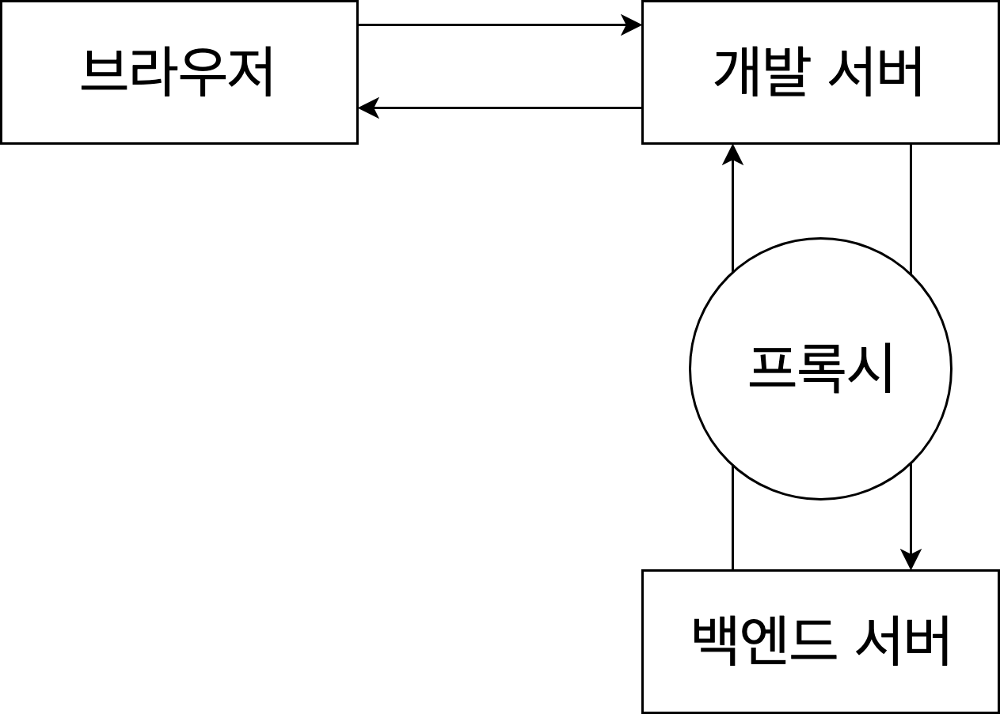

# 7.6~9

## 6. API 재로딩 문제 해결

1. 데이터가 이미 존재하면 요청X

2. 로딩을 새로할 때 로딩중 표시를 띄우지 않는 것(뒤로가기로 최신 데이터 요청 가능)

### 1) 데이터가 이미 존재하면 요청X

**containers/PostListContainer.js**

```jsx
function PostListContainer() {
  const { data, loading, error } = useSelector((state) => state.posts.posts);
  const dispatch = useDispatch();

  useEffect(() => {
    // 데이터 있으면 요청 X
    if (data) return;
    dispatch(getPosts());
  }, [data, dispatch]);

  if (loading) return <div>로딩중...</div>;
  if (error) return <div>에러 발생!</div>;
  if (!data) return null;
  return <PostList posts={data} />;
}
```

### 2) 로딩을 새로할 때 로딩중 표시X (뒤로가기로 최신 데이터 요청 가능)

**lib/asyncUtils.js - handleAsyncActions.js**

```jsx
export const handleAsyncActions = (type, key, keepData = false) => {
  const [SUCCESS, ERROR] = [`${type}_SUCCESS`, `${type}_ERROR`];
  return (state, action) => {
    switch (action.type) {
      case type:
        return {
          ...state,
          [key]: reducerUtils.loading(keepData ? state[key].data : null),
        };
      case SUCCESS:
        return {
          ...state,
          [key]: reducerUtils.success(action.payload),
        };
      case ERROR:
        return {
          ...state,
          [key]: reducerUtils.error(action.error),
        };
      default:
        return state;
    }
  };
};
```

→ `keepdata` 파라미터를 통해 로딩에서 데이터 요청 유무를 선택가능

**modules/posts.js - posts 리듀서**

```jsx
export default function posts(state = initialState, action) {
  switch (action.type) {
    case GET_POSTS:
    case GET_POSTS_SUCCESS:
    case GET_POSTS_ERROR:
      return handleAsyncActions(GET_POSTS, "posts", true)(state, action);
    case GET_POST:
    case GET_POST_SUCCESS:
    case GET_POST_ERROR:
      return handleAsyncActions(GET_POST, "post")(state, action);
    default:
      return state;
  }
}
```

→ `handleAsyncActions` 의 `keepdata` 파라미터가 추가

**containers/PostListContainer.js**

```jsx
function PostListContainer() {
  const { data, loading, error } = useSelector((state) => state.posts.posts);
  const dispatch = useDispatch();

  // 컴포넌트 마운트 후 포스트 목록 요청
  useEffect(() => {
    dispatch(getPosts());
  }, [dispatch]);

  if (loading && !data) return <div>로딩중...</div>; // 로딩중이면서, 데이터가 없을 때에만 로딩중... 표시
  if (error) return <div>에러 발생!</div>;
  if (!data) return null;

  return <PostList posts={data} />;
}
```

→ `if(loading && !data)` 조건변경으로 `data` 가 없을 때만 로딩을 띄움

### 포스트 조회시 재로딩 문제 해결

1. 컴포넌트가 언마운트될 때, 포스트 내용 비우기
   → 단점 : 이미 읽은 포스트도 새로 요청

2. `posts` 모듈에서 관리하는 상태의 구조 변경

3. 요청은 하되 로딩 표시 X

### **컴포넌트가 언마운트될 때, 포스트 내용 비우기**

- 리덕스 모듈 `posts.js` 에 `CLEAR_POST` 액션 추가

**modules/posts.js**

```jsx
// 포스트 비우기
const CLEAR_POST = "CLEAR_POST";

export const clearPost = () => ({ type: CLEAR_POST });

export default function posts(state = initialState, action) {
  switch (action.type) {
    // ...
    case CLEAR_POST:
      return {
        ...state,
        post: reducerUtils.initial(),
      };
    default:
      return state;
  }
}
```

- 컴포넌트 `PostContainer` 의 `useEffect` 의 `cleanup` 함수에서 해당 액션 디스패치

**containers/PostContainer.js**

```jsx
function PostContainer({ postId }) {
  //...
  useEffect(() => {
    dispatch(getPost(postId));
    return () => {
      dispatch(clearPost());
    };
  }, [postId, dispatch]);
  //...
}
```

### `posts` 모듈에서 관리하는 상태의 구조 변경

asyncUtils의 함수 커스터마이징 or 새로 선언

- `createPromiseThunkById`
- `handleAsyncActionsById`

**lib/asyncUtils.js**

```jsx
(...)
// 특정 id 를 처리하는 Thunk 생성함수
const defaultIdSelector = param => param;
export const createPromiseThunkById = (
  type,
  promiseCreator,
  // 파라미터에서 id를 어떻게 선택 할 지 정의하는 함수
  // 기본 값으로는 파라미터를 그대로 id로 사용
  // 파라미터가 객체 { id: 1, details: true }라면 파라미터의 키값 지정
  idSelector = defaultIdSelector
) => {
  const [SUCCESS, ERROR] = [`${type}_SUCCESS`, `${type}_ERROR`];

  return param => async dispatch => {
    const id = idSelector(param);
    dispatch({ type, meta: id });
    try {
      const payload = await promiseCreator(param);
      dispatch({ type: SUCCESS, payload, meta: id });
    } catch (e) {
      dispatch({ type: ERROR, error: true, payload: e, meta: id });
    }
  };
};

// id별로 처리하는 유틸함수
export const handleAsyncActionsById = (type, key, keepData = false) => {
  const [SUCCESS, ERROR] = [`${type}_SUCCESS`, `${type}_ERROR`];
  return (state, action) => {
    const id = action.meta;
    switch (action.type) {
      case type:
        return {
          ...state,
          [key]: {
            ...state[key],
            [id]: reducerUtils.loading(
              // state[key][id]가 없을 수도 있으니까 유효성 검사 후 data 조회
              keepData ? state[key][id] && state[key][id].data : null
            )
          }
        };
      case SUCCESS:
        return {
          ...state,
          [key]: {
            ...state[key],
            [id]: reducerUtils.success(action.payload)
          }
        };
      case ERROR:
        return {
          ...state,
          [key]: {
            ...state[key],
            [id]: reducerUtils.error(action.payload)
          }
        };
      default:
        return state;
    }
  };
};
```

**modules/posts.js**

```jsx
(...)
export default function posts(state = initialState, action) {
  switch (action.type) {
    case GET_POSTS:
    case GET_POSTS_SUCCESS:
    case GET_POSTS_ERROR:
      return handleAsyncActions(GET_POSTS, 'posts', true)(state, action);
    case GET_POST:
    case GET_POST_SUCCESS:
    case GET_POST_ERROR:
      return handleAsyncActionsById(GET_POST, 'post')(state, action);
    default:
      return state;
  }

```

로딩 표시 처리

1. 데이터 있으면 요청 X

2. 요청은 하되 로딩 표시 X

### 데이터 있으면 요청 X

**containers/PostContainer.js**

```jsx
function PostContainer({ postId }) {
  const { data, loading, error } = useSelector(
    (state) => state.posts.post[postId]
  ) || {
    loading: false,
    data: null,
    error: null,
  }; // 아예 데이터가 존재하지 않을 때가 있으므로, 비구조화 할당이 오류나지 않도록
  const dispatch = useDispatch();

  // 포스트가 존재하면 아예 요청을 하지 않음
  useEffect(() => {
    if (data) return;
    dispatch(getPost(postId));
  }, [postId, dispatch, data]);

  if (loading) return <div>로딩중...</div>;
  if (error) return <div>에러 발생!</div>;
  if (!data) return null;

  return <Post post={data} />;
}
```

### 요청은 하되 로딩 표시 X

**modules/posts.js - posts**

```jsx
export default function posts(state = initialState, action) {
  switch (action.type) {
    case GET_POSTS:
    case GET_POSTS_SUCCESS:
    case GET_POSTS_ERROR:
      return handleAsyncActions(GET_POSTS, "posts", true)(state, action);
    case GET_POST:
    case GET_POST_SUCCESS:
    case GET_POST_ERROR:
      return handleAsyncActionsById(GET_POST, "post", true)(state, action);
    default:
      return state;
  }
}
```

**containers/PostContainer.js**

```jsx
import React, { useEffect } from "react";
import { useSelector, useDispatch } from "react-redux";
import { getPost } from "../modules/posts";
import Post from "../components/Post";

function PostContainer({ postId }) {
  const { data, loading, error } = useSelector(
    (state) => state.posts.post[postId]
  ) || {
    loading: false,
    data: null,
    error: null,
  }; // 아예 데이터가 존재하지 않을 때가 있으므로, 비구조화 할당이 오류나지 않도록
  const dispatch = useDispatch();

  useEffect(() => {
    dispatch(getPost(postId));
  }, [dispatch, postId]);

  // 로딩중이고 데이터 없을때만
  if (loading && !data) return <div>로딩중...</div>;
  if (error) return <div>에러 발생!</div>;
  if (!data) return null;

  return <Post post={data} />;
}

export default PostContainer;
```

## 7. thunk에서 라우터 연동

연동 예시) 로그인 성공 시 `/` 로 이동 || 실패 시 경로 유지

? 컨테이너 컴포넌트에서 단순히 withRouter 사용해서 props로 history를 가져와서 써도 무방

### customHistory 만들어서 적용

**index.js**

```jsx
import ReduxThunk from 'redux-thunk';
import { createBrowserHistory } from 'history';

const customHistory = createBrowserHistory();

const store = createStore(
  rootReducer,
  composeWithDevTools(
    applyMiddleware(
      ReduxThunk.withExtraArgument({ history: customHistory }),
      logger
    )
  )
);
(...)
```

→ redux-thunk의 `withExtraArgument` : thunk 함수에서 사전에 정한 값(`history`)을 참조 가능

### 홈으로 가는 thunk 만들기

**modules/posts.js - goToHome**

```jsx
// 3번째 인자를 사용하면 withExtraArgument 에서 넣어준 값들을 사용 할 수 있습니다.
export const goToHome =
  () =>
  (dispatch, getState, { history }) => {
    history.push("/");
  };
```

## 8. json-server

가짜 API 서버. 실제 프로젝트에 쓰지 말자

**data.json**

```json
{
  "posts": [
    {
      "id": 1,
      "title": "리덕스 미들웨어를 배워봅시다",
      "body": "리덕스 미들웨어를 직접 만들어보면 이해하기 쉽죠."
    },
    {
      "id": 2,
      "title": "redux-thunk를 사용해봅시다",
      "body": "redux-thunk를 사용해서 비동기 작업을 처리해봅시다!"
    },
    {
      "id": 3,
      "title": "redux-saga도 사용해봅시다",
      "body": "나중엔 redux-saga를 사용해서 비동기 작업을 처리하는 방법도 배워볼 거예요."
    }
  ]
}
```

### 서버 열기

```
$ npx json-server ./data.json --port 400
```

or

```
$ yarn global add json-server
$ json-server ./data.json --port 4000
```

→ yarn 을 통한 글로벌 설치가 작동 안 될 경우
→  [https://yarnpkg.com/en/docs/install](https://yarnpkg.com/en/docs/install) 페이지의 Path setup 부분 참고 (윈도우는 yarn 삭제 후 재설치를 하면 해결 될 수도)
→ or `npm install -g json-server`

### axios로 API 요청하기

**api/posts.js**

```jsx
export const getPosts = async () => {
  const response = await axios.get("http://localhost:4000/posts");
  return response.data;
};

export const getPostById = async (id) => {
  const response = await axios.get(`http://localhost:4000/posts/${id}`);
  return response.data;
};
```

## 9. CORS와 Webpack Devserver Proxy

CORS : 다른 도메인에서의 API 요청을 허용
→ 브라우저의 현재 주소와 API의 주소의 도메인이 일치해야만 데이터 접근 가능(브라우저 기본)

json-server는 CORS 허용

### 웹팩 개발서버 Proxy



웹팩 개발서버 프로시 사용 시,
브라우저 API를 요청할 때 현재 개발서버의 주소로 요청(백엔드 서버에 직접 요청X)
→ 웹팩 개발 서버: 브라우저의 해당 요청을 받아서 백엔드 서버로 전달
→ 웹팩 개발 서버: 백엔드 서버의 응답을 받아서 브라우저에 반환
→ CRA는 `package.json`에서 `proxy` 값을 설정하여 쉽게 적용가능

**package.json**

```json
  (...),
  "proxy": "http://localhost:4000"
}
```

### 배포 시

리액트 서비스 도메인과 API 도메인이 다를 경우 : axios의 글로벌 `baseURL` 설정

```jsx
axios.defaults.baseURL =
  process.env.NODE_ENV === "development" ? "/" : "https://~";
```

→ 개발 환경: 프록시 서버로 요청
→ 프로덕션: 실제 API 서버로 요청

`process.env.NODE_ENV` : 현재 환경이 프로덕션인지 개발모드인지 볼 수 있는 값 ([참고](https://create-react-app.dev/docs/adding-custom-environment-variables))
